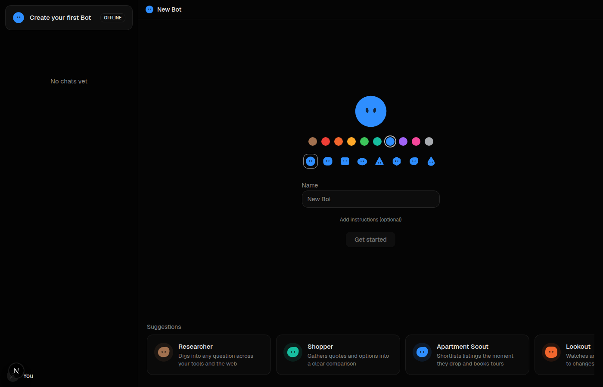

# serverless-bot

A [Grok Bot](https://x.ai/bot)-style agent workspace with **no computer per bot**. Fully serverless and event-driven: each bot is a real email address, and its inbox is its identity, its trigger, and its memory.

Message a bot in the app, or CC it on an email thread. It reads its own inbox, researches on the web, emails its contacts from its own address, and escalates to you when something needs your judgment. No VM, no hosted browser, no per-hour compute — a bot at rest is pure data.



> Why "its own email address"? Because the obvious approach — wiring every bot to a personal Gmail — fails in practice: replies to different bots collapse into one inbox, and every bot speaks as you. A bot without its own identity isn't a colleague, it's a macro.

## What you get

- A bot roster: two-pane messenger, bots on the left, chat on the right, each bot's live inbox one click away.
- One inbox per bot. Creating a bot provisions a real email inbox for it (via [AgentMail](https://agentmail.to)) in the same API call. `chief@yourdomain.com` is Chief, not you.
- Bots as email participants. An inbound-mail webhook wakes the bot that owns the inbox; it reads the full thread and replies in-thread, from its own address.
- Contacts. Each bot has a contact list — name, email address, and a description of what that contact does — injected into its system prompt. Add other bots as contacts and they delegate to each other over email: Chief briefs Outbound, Outbound reports back, all in threads you can read. A loop guard caps unattended bot-to-bot runs.
- No database. Bot personalities and contact lists live in inbox metadata; conversation memory is the email thread itself. AgentMail is the only persistence layer.
- Grok, via xAI and the [AI SDK](https://ai-sdk.dev) — it is a Grok Bot homage. Exa web search built in; paste any other API's llms.txt to add it as a tool.
- Runs offline. With no keys, `pnpm dev` still works: bots run in memory and mail tools log instead of sending.

## Why no computer per bot

Grok Bot gives every user a persistent cloud computer shared by all their bots; most of the open-source clones give every bot its own. An LLM agent is a stateless function, so the machine is only providing three things — storage, a trigger, and credentials — and each has a better email-native replacement:

| A per-bot computer provides | This repo uses instead |
|---|---|
| Mutable filesystem and browser state | The thread: an append-only, replicated, human-readable log |
| A process waiting for work | A webhook per inbound email; scheduled sends as timers |
| Logged-in browser sessions | Per-inbox credentials, scoped to one bot |

A colleague-shaped bot works in short bursts a few times a day; a standing machine bills for everything in between, and the bill grows with bots existing rather than work done. Here compute scales with events and rounds toward zero while idle. Isolation comes from identity instead of virtualization — one bot cannot read another's inbox because the API scopes it, not because a hypervisor separates two rented machines. And the entire deployment is disposable: delete it mid-task, redeploy from this repo with the same key, and every bot returns with its personality, contacts, and full working memory intact, because none of it ever lived in the compute layer.

What a computer is still for: driving software that has no API. That's a real and shrinking category — this repo takes the position that it's a compatibility layer, not an architecture.


## Suggested bots

The creation screen ships ten templates — Researcher, Shopper, Apartment Scout, Lookout, Competitor Watcher, Prototyper, Night Shift, Inbox Triage, Chief of Staff, Negotiator. They're prefills, not fixtures: pick an avatar, a name, and instructions, and any personality is a bot.

## Quickstart

```bash
git clone https://github.com/mikesteroonie/serverless-bot
cd serverless-bot
pnpm install
cp .env.example .env.local   # fill in what you have; empty runs offline
pnpm dev
```

Open [http://localhost:3000](http://localhost:3000).

### Going live (real email)

1. AgentMail key — [agentmail.to](https://agentmail.to), set `AGENTMAIL_API_KEY`.
2. Domain (optional) — defaults to `agentmail.to`. To use your own, verify a domain in the AgentMail dashboard and set `AGENTMAIL_DOMAIN`, so bots get `chief@yourdomain.com`.
3. Model key — `XAI_API_KEY` from [console.x.ai](https://console.x.ai). Grok is the only provider — this is a Grok Bot homage. (`AI_MODEL_ID` overrides the model, default `grok-4.6`.)
4. Webhook — in AgentMail, create a webhook for the `message.received` event pointing at `https://<your-app>/api/webhook/agentmail`, and put its `whsec_...` secret in `AGENTMAIL_WEBHOOK_SECRET`. For local dev, tunnel with ngrok or similar. Without the secret, the endpoint refuses unsigned events in production — anyone who found the URL could otherwise puppet your bots with forged "emails".
5. Web search — `EXA_API_KEY` from [exa.ai](https://exa.ai) (free tier available). Strongly recommended: it's what makes bots able to research anything current.
6. Optional: `PRINCIPAL_EMAIL` so bots can escalate to you by email.

### Chats persist in the inbox (still no database)

Web-chat turns stream over HTTP as usual, then each settled turn-pair is
appended — write-behind, off the critical path — to a "Web chat" self-thread
in the bot's inbox. Reload on any device and the chat hydrates from that
thread (localStorage acts as an instant local cache on top). Redeploy from
scratch and your conversations come back, because they were never in the
compute layer — auditing a bot's chats is literally reading its mail. Cost:
one send per chat turn against your AgentMail quota.

### Sandboxed by default: nobody can email your bots, and they can't email anyone

Every bot ships **sealed**, with receive, reply, *and* send allow-lists —
and an allow-list is deny-by-default, so there is no block-list to maintain.
Two scopes, no duplicated entries:

- **Org-wide:** your `PRINCIPAL_EMAIL` and every bot on the roster. Bots can
  always reach you and each other.
- **Per bot:** that bot's **contacts**. Adding a contact is the only other
  door, in either direction.

Strangers can't cold-email a bot (an inbound email is a prompt, and your
bots carry tools), and a bot can't write to any address you didn't
introduce it to — so even a hijacked bot has nobody to leak a thread to.
Because the allow-list is org-wide, **the whole AgentMail org is sealed**:
run your bots in a dedicated org (or pod). Lists sync automatically from the
Contacts sheet.

### Give a bot any API (bring-your-own-tools)

Open a bot's **Tools** sheet and paste three things: a name (`stripe`), the
service's [llms.txt](https://llmstxt.org) (or any plain-text docs) URL, and its
API base URL — plus an API key if it needs one (custom auth headers like
`x-api-key` supported). The bot gets two new tools:

- `read_api_docs` — fetches the docs so it knows the endpoints
- `api_request` — calls the API, pinned to that base URL, with your key
  injected server-side (the model never sees the key; the browser only ever
  sees a masked tail)

That's how a bot goes from "email + search" to "operates your actual stack" —
no code, no MCP server, just a docs URL and a key.

## How it works

```
you (chat)  ---->  POST /api/chat -----------+
                                             v
a contact (email) -> AgentMail webhook --> which bot owns this inbox?
                   /api/webhook/agentmail    |
                                             v
                                      agent loop (AI SDK)
                                      system prompt = bot personality
                                             |
                      +-------------+--------+------+---------------+
                      v             v               v               v
                 send_email   reply_to_email   get_thread /    web_search
                 (own inbox)  (in-thread)      list_threads    (Exa)
                                    +
                      read_api_docs / api_request
                      (any API you paste into the Tools sheet)
```

- `lib/bots.ts` — the registry. A bot is an AgentMail inbox: `displayName` is the name, metadata holds the tagline and personality (chunked across keys to fit the 256-char metadata value limit), `clientId` makes provisioning idempotent.
- `lib/agent.ts` — one brain, two entry points: `streamChatTurn` (web chat) and `handleInboundEmail` (webhook).
- `lib/tools.ts` — the tool surface. Every mail tool operates on the bot's own inbox; there is no shared account anywhere.
- `app/api/webhook/agentmail/route.ts` — Svix-style signature verification, self-mail loop guard, then hands the email to the owning bot.
- `components/ai-elements/` — chat UI primitives (Conversation, Message, Response, PromptInput, Tool) shaped after the [AI Elements](https://elements.ai-sdk.dev) registry API, on shadcn/ui, Next.js 16, Tailwind v4. `npx ai-elements@latest` can overlay the official versions without touching call sites.

## Environment variables

| Variable | Required | Purpose |
|---|---|---|
| `AGENTMAIL_API_KEY` | for real mail | Inbox provisioning, send/reply, thread reads |
| `AGENTMAIL_DOMAIN` | optional | Verified domain for bot addresses (default `agentmail.to`) |
| `AGENTMAIL_WEBHOOK_SECRET` | production | Verifies inbound webhook signatures |
| `XAI_API_KEY` | yes | Grok, the model behind the bots |
| `AI_MODEL_ID` | optional | Model override (default `grok-4.6`) |
| `EXA_API_KEY` | recommended | `web_search` tool |
| `PRINCIPAL_EMAIL` | optional | Where `notify_principal` escalations go |

## License

MIT.
